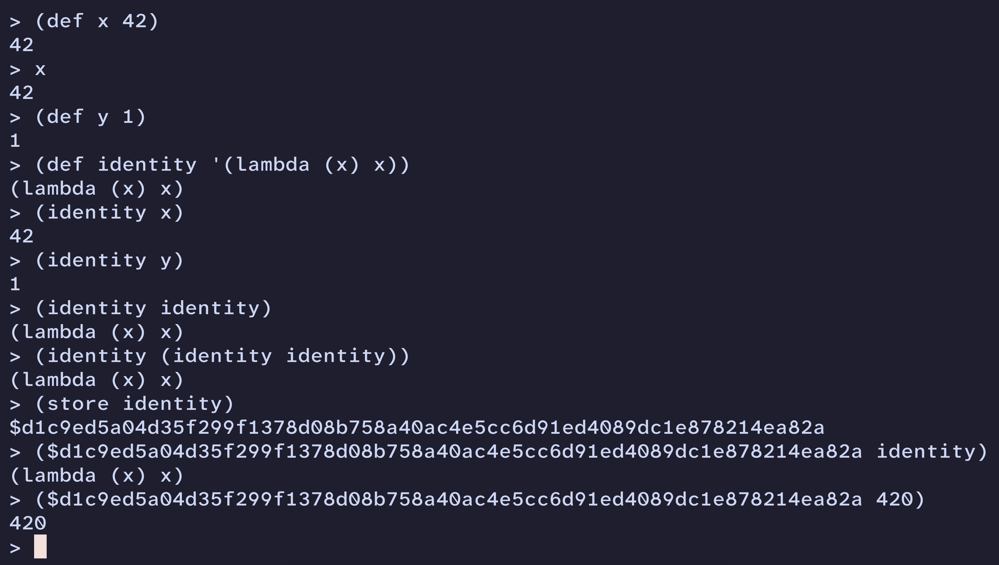

# Omni

Omni is a content-addressable Lisp that is designed to be embedded and sandboxed.

Any Omni expression can be referenced by its SHA256 hash.
This creates unique capabilities for versioning and distribution of the language.

Omni is heavily inspired by [scrapscript](https://scrapscript.org/).

## Example



## Roadmap

### Types
 - [x] Int
 - [x] Symbol
 - [x] Hash (e.g. `$0ef324...`)
 - [x] List
 - [x] Quote (e.g. `'42`)
 - [x] Quasi-Quote (e.g. `` `(1 2 ,(+ 2 2)) ``)
 - [x] Spread (e.g. `` `(1 2 ,@'(3 4)) ``)
 - [ ] String
 - [ ] Other Types TBD...

### Parsing
 - [x] Basic Parsing
 - [ ] Whole File Parsing
 - [ ] Switching to Streaming Parsers
 - [ ] Span Location Tracking

### REPL
 - [x] Basic Functionality

### Interpreter
 - [x] Basic Math
 - [x] `store` for Storing Expressions in the Current Registry
 - [x] `def` for defining expressions in the current environment

### Registries

A Registry is a scheme for storing and retrieving expressions based on hashes. 

Using SHA256 hashes provides interesting security features to ensure that a remote registry has not modified the expression.
Most registries (`HttpRegistry` and `FileStoreRegistry`) will verify the hash of retrieved expressions to ensure they have not been tampered with.
For performance sake, `CachedRegistry` will likely trust its local cache directory and not perform extra hashing.

 - [x] `NullRegistry` for testing
 - [x] `FileStoreRegistry` for testing
 - [ ] `HttpRegistry` and a `registry-server` for production use
 - [ ] `CachedRegistry` for production use
> This registry will wrap another registry, but use a local `.omni/` folder-based registry cache.
Any requests to retrieve expressions will first hit the local cache, and then go to the wrapped registry if the local cache is missing the entry.
After pulling from the wrapped registry, `CachedRegistry` will also store the entry locally to provide fast resolution on subsequent pulls.
In the future, `CachedRegistry` may also store small enough expressions in memory, so it could even avoid the file seek and read.
 - [ ] Module Hashes

In the language, there will be a need for easily importing code from other projects.
Currently, you can only hash and address single expressions.
But to support easily importing libraries of code, there will be a need for hashing and addressing groups of expressions.
I am hesitantly calling this concept a module.
A module is simply a collection of code that can export any number of definitions using a built-in function (probably `(export magic-number 42)`).
Whenever the calling code imports a module, they can choose to import it un-scoped or to define their own alias/prefix.
For example, `(import fun-stuff $1234...)` would prefix all namespace exports with `fun-stuff`, so you could refer to `fun-stuff/magic-number`.
Modules may do these sorts of imports as well, so some of their exports will already be "namespaced" in this manner (e.g. `fun-stuff/integers/one`).
These module imports will require integration with the below point of expression aliases.
The proposed dependency mapping file below may create some default module aliases which could then be imported by any other file.
For example, calling `(import http)` would automatically look for the `http` mapping in the dependencies file, and import that module under the `http` namespace in the current file.

 - [ ] Expression Aliases

Hashes provide great benefits, but 64-character long hashes are not the easiest to work with in source code.
Eventually, there will be a need for an aliasing system that can assign human-friendly names to hashes.
Remote registries could offer mappings between aliases and hashes, but that requires trusting the remote registry and would create competition in the ecosystem for the best alias names.
A possible alternative would be maintaining a mapping file locally in each project, similar to how other languages use lock files to pin down dependency versions.
This dependency file could look something like this:
```lisp
(dependencies
  (http $1234...)
  (buftools $0043...)
  (url $8888...))
```
This approach could provide the best balance of security and control.
Projects could advertise their dependency mapping for other projects to use (e.g. "Import `http` with `(http $1234...)`").
All dependencies would be clearly pinned by default, making it very easy to verify dependencies or switch versions (different versions would simply have different hashes).
